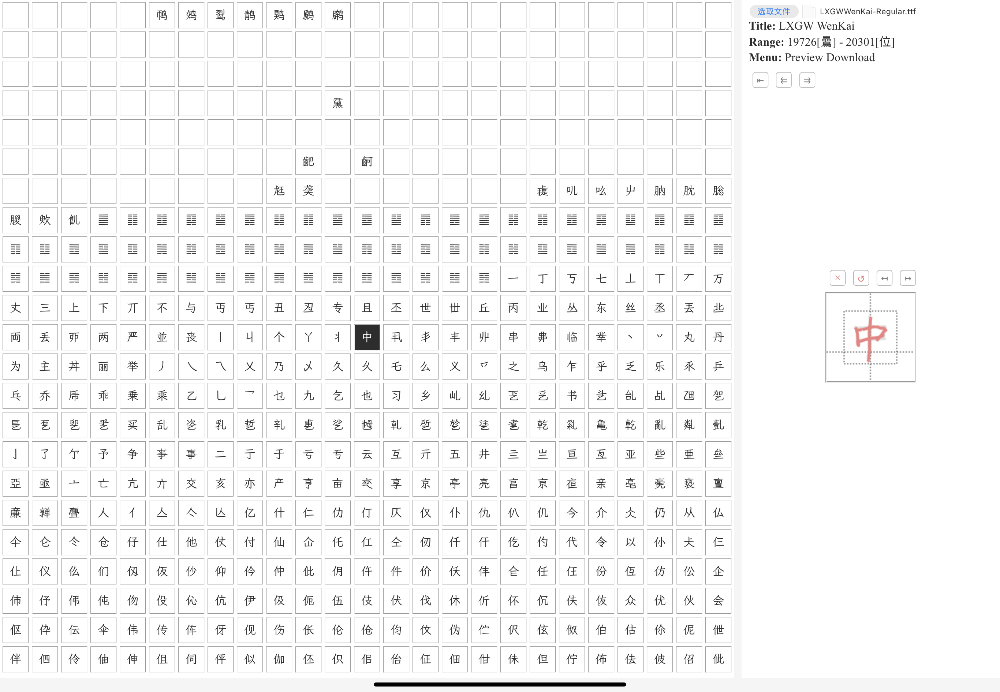

# Handwriting font editor (unfinished)
TODO: generate glyphs from touch traces.

## Development
```sh
# clone and cd to project root

# run development container
cd ./tools/develop
docker compose up -d
docker start -i font-editor.dev

# begin
cd ~/Projects/font-editor
npm install
npm run serve
```

## Screenshots

